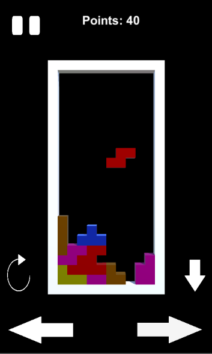
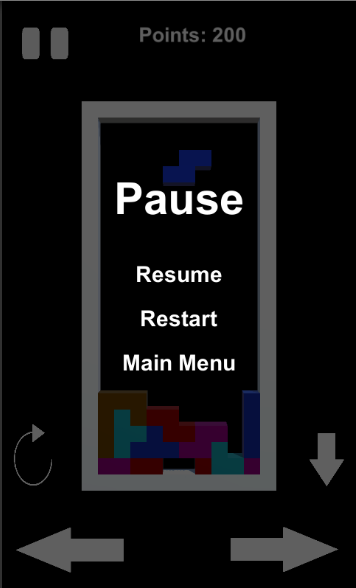

# 3D Tetris

## Sections

 - [Visuals](#visuals)
 - [Description](#description)
	 - [General](#general)
	 - [Main features](#main-features)
	 - [Game Engine](#game-engine)
	 - [Programming languages and libraries](#programming-languages-and-libraries)
 - [Usage](#usage)

## Visuals

## Description

### General
3D Tetris for android made in Unity

### Main features
  - 3D models made in Blender
  - Tetris mechanics
  - Three levels of difficulty
  - High scores
  - Pausing game

### Game Engine
- Unity

### Programming languages and libraries
 - C#

## Usage
 - Playing game
